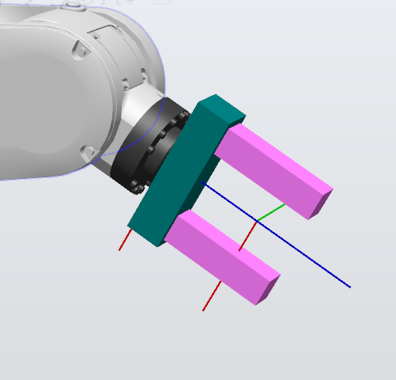
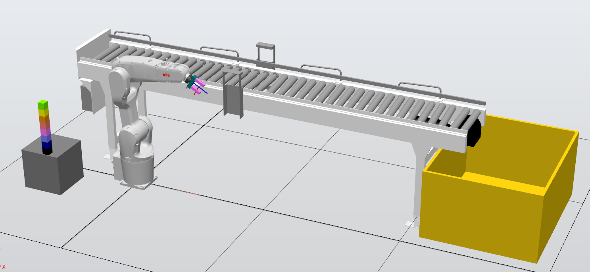
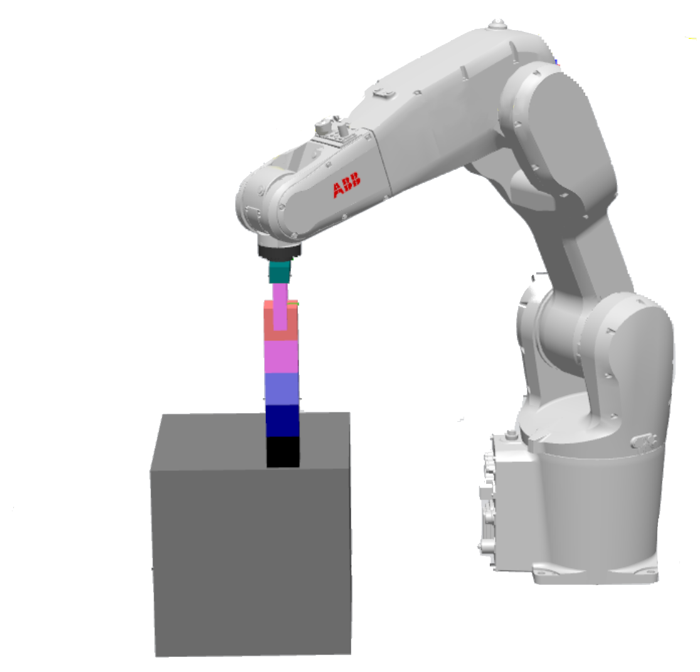

# Robotic Production Line Simulation

This repository contains a RobotStudio 2023 simulation project of a robotic material handling production line.

## Table of Contents

- [Project Overview](#project-overview)
- [Station Components](#station-components)
- [Simulation and Physics](#simulation-and-physics)
- [Smart Component & I/O Logic](#smart-component--io-logic)
- [RAPID Control Code](#rapid-control-code)
- [Project Metadata](#project-metadata)

## Project Overview

The main goal of this project is to design, program, and simulate an automated robotic production line using ABB RobotStudio 2023.

The system utilizes an industrial robot manipulator to pick individual blocks from a stacked tower of 8 blocks and place them onto a conveyor belt. The conveyor then transports the blocks and drops them into a collection container. The control logic is implemented in RAPID to allow flexible operations, such as transferring all blocks, a single block, or any custom quantity.

## Station Components

The simulation layout is comprised of the following key elements:

### Industrial Robot

- ABB IRB 1200-5/0.9 (`IRB1200_5_90_STD_03`)
- Selected based on payload/reach capabilities, the block sizes (5 cm × 5 cm), and compatible controller support.

### Custom Gripper

- Created from scratch to handle the 5 cm × 5 cm blocks.
- Used because the standard RobotStudio grippers had an insufficient finger span.



### Conveyor Belt

- Standard 400-guide roller conveyor used to transport the parts.

### Feeder Table

- Simplified table acting as the starting platform for the stacked blocks.

### Collection Bin

- Located at the end of the conveyor belt to catch the finished blocks.

## Simulation and Physics

To accurately replicate real-world physical interactions, the following physics properties were implemented:

- **Blocks & Table:** Configured with Dynamic Physics to allow realistic gravitational stacking, collisions, and physical interaction during gripping.
- **Conveyor Belt:** Configured with Kinematic Physics with a linear surface movement speed set to 700 mm/s.

Note: The conveyor speed was optimized to ensure that blocks do not get stuck between the physical rollers and can reliably reach the collection container.

## Smart Component & I/O Logic

The physical behavior of the gripper is controlled using RobotStudio's Smart Components:

- **LineSensor:** Positioned between the gripper fingers to detect the presence of a block.
- **Attacher & Detacher:** Used to programmatically attach/detach the block to/from the robot's tool-point based on I/O signals.
- **PoseMover:** Controls the visual animation of the gripper's fingers opening (`HomePose`) and closing (`grp_closed`).

This logical setup ensures that the simulated picking mechanics match real-life sensor-triggered behaviors rather than relying strictly on perfect virtual attachments.

## RAPID Control Code

The entire operation is automated using a RAPID control module (Module1).

A FOR loop is utilized to iterate through the blocks ($0$ to $7$).

The Offs function dynamically calculates the Z-offset relative to the base targets (nad_klocek and klocek) by shifting downward by 50 mm for each consecutive block level (z × (-50)).

### RAPID Module: Module1

```rapid
MODULE Module1

    CONST robtarget dom:= [[522.01408311,0,848.1], [0.5,0,0.866025404,0], [0,0,0,0], [9E+09,9E+09,9E+09,9E+09,9E+09,9E+09]];
    CONST robtarget nad_klocek:=[[-500,-375,810], [0,0.707106781,0.707106781,0], [-2,0,-1,0], [9E+09,9E+09,9E+09,9E+09,9E+09,9E+09]];
    CONST robtarget klocek:=[[-500,-375,700], [0,0.707106781,0.707106781,0], [-2,0,-1,0], [9E+09,9E+09,9E+09,9E+09,9E+09,9E+09]];
    CONST robtarget nad_tasme:=[[-30.156,599.226,805], [0,1,0,0], [0,0,-2,0], [9E+09,9E+09,9E+09,9E+09,9E+09,9E+09]];
    CONST robtarget tasma:=[[-39.156,599.226,735], [0,1,0,0], [0,0,-2,0], [9E+09,9E+09,9E+09,9E+09,9E+09,9E+09]];
    
    VAR robtarget nad_klocekvar;
    VAR robtarget klocekvar;
    
    PROC Path_10()
        FOR z FROM 0 TO 7 DO
            nad_klocekvar:=Offs(nad_klocek,0,0,z*(-50));
            klocekvar:=Offs(klocek,0,0,z*(-50));
            tower;
        ENDFOR
        WaitTime 5;
    ENDPROC
    
    PROC tower()
        MoveL dom, v1000, z100, My_Gripper_Mech_1\WObj:=Workobject_1;
        SetDO Attacher, 0;
        SetDO Detacher, 1;
        MoveJ nad_klocekvar, v1000, z100, My_Gripper_Mech_1\WObj:=Workobject_1;
        WaitTime 0.5;
        MoveL klocekvar, v1000, z100, My_Gripper_Mech_1\WObj:=Workobject_1;
        SetDO Detacher, 0;
        WaitTime 0.5;
        SetDO Attacher, 1;
        WaitTime 0.3;
        MoveL nad_klocekvar, v1000, z100, My_Gripper_Mech_1\WObj:=Workobject_1;
        MoveJ nad_tasme, v1000, z100, My_Gripper_Mech_1\WObj:=Workobject_1;
        WaitTime 0.3;
        MoveL tasma, v1000, z100, My_Gripper_Mech_1\WObj:=Workobject_1;
        WaitTime 0.3;
        SetDO Detacher, 1;
        SetDO Attacher, 0;
        MoveL nad_tasme, v1000, z100, My_Gripper_Mech_1\WObj:=Workobject_1;
        MoveJ dom, v1000, z100, My_Gripper_Mech_1\WObj:=Workobject_1;
        WaitTime 0.1;
    ENDPROC

ENDMODULE
```

